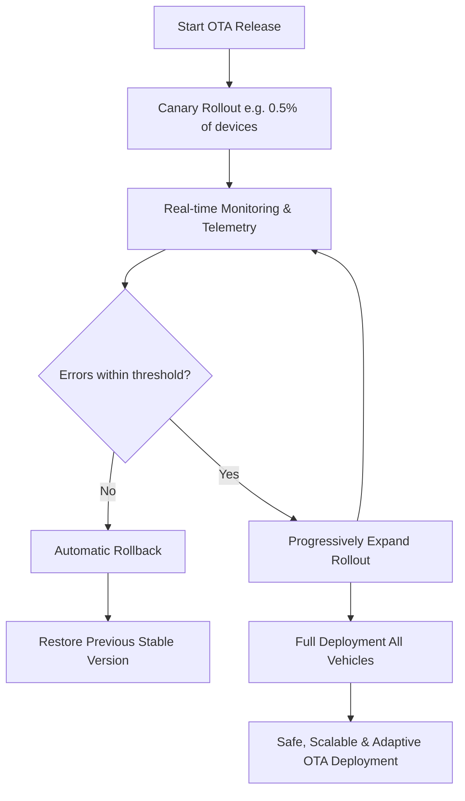

# SolutionPlan_Template

# 1. Your Team at a Glance

## COOTA - Updating mobility, orchestrating trust.
Canary Orchestrator for Over The Air

## Team Members
| Name             | GitHub Handle | Role(s)      |
|------------------|---------------|--------------|
| Joao Chagas      | joaocalixto   | Pitch writer |
| João Barradas    |  jbarradas | front-end    |
| Gustavo Calonico |  randomcash  | back-end     |
| Nuno Valente     |  nuvan | back-end     |
| Lui Varela       |  man-lvarela | back-end     |

## Challenge
Update Possible Challenge: OTA updates for ECUs

## Core Idea
Implement a CI/CD-driven OTA release process with real-time monitoring and automated decision logic.
Deploy updates via canary rollout (e.g., 0.5% of devices), expand rollout progressively if telemetry shows no regression, or trigger an automatic rollback when error budgets are exceeded.
This ensures safe, scalable, and adaptive OTA deployments.

---

# 2. How Do You Work

## Development Process
*Brief overview of your development process.*

### Planning & Tracking
*How do you plan and track progress?*

### Quality Assurance
*How do you ensure quality (e.g., testing, documentation, code reviews)?*

## Communication
*How does your team communicate?*

## Decision Making
*How are decisions made in your team?*
