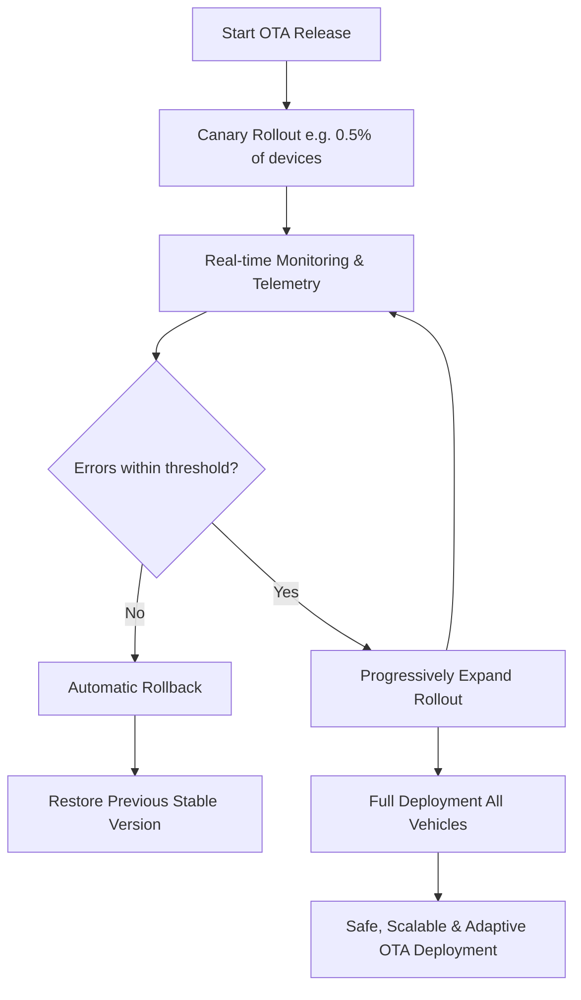

# SolutionPlan_Template

# 1. Your Team at a Glance

## COOTA - Updating mobility, orchestrating trust.
Canary Orchestrator for Over The Air

## Team Members
| Name             | GitHub Handle | Role(s)      |
|------------------|---------------|--------------|
| Joao Chagas      | joaocalixto   | Pitch writer |
| João Barradas    |  jbarradas | front-end    |
| Gustavo Calonico |  randomcash  | back-end     |
| Nuno Valente     |  nuvan | back-end     |
| Lui Varela       |  man-lvarela | back-end     |

## Challenge
Update Possible Challenge: OTA updates for ECUs

## Core Idea
Implement a CI/CD-driven OTA release process with real-time monitoring and automated decision logic.
Deploy updates via canary rollout (e.g., 0.5% of devices), expand rollout progressively if telemetry shows no regression, or trigger an automatic rollback when error budgets are exceeded.
This ensures safe, scalable, and adaptive OTA deployments.

---

# 2. How Do You Work

## Development Process
Development Process - Iterative approach
1.  Deploy & rollback – The first milestone was making deployment and rollback mechanisms functional.
2.  Error monitoring – Functional code was connected to COOTA module to read errors and validate the next course of action.
3.  Scalable rollout – Once stability was achieved, we focused on enabling deployment at scale.
4. Team division – To move faster, we split into three focus areas:

•	Pitch & presentation
•	Back-end
•	Front-end

### Planning & Tracking
We started with a brainstorming session to define the core idea and outline our priorities. From there, progress was tracked through constant update checks and quick syncs to adapt to new challenges and keep everyone aligned.

### Quality Assurance
Given the short timeframe, we focused on starting small and writing clean and iteratively scale, to ensure clarity. We hope that this approach can make collaboration smoother and reduced integration issues.

## Communication
Communication happened both in person during the hackathon and through a shared Slack group channel, ensuring quick exchanges and transparency across the team.

## Decision Making
All important decisions were made through unanimous agreement. This ensured that every team member was aligned with the direction and felt ownership of the solution.
