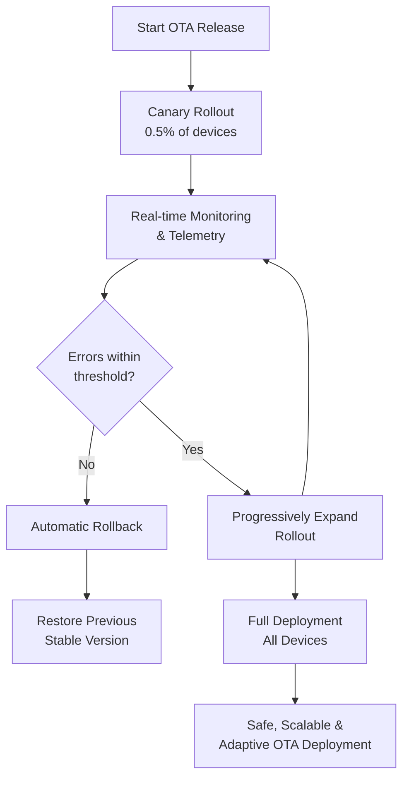

# COOTA - Getting Started Guide

<div align="center">


**Canary Orchestrator for Over-The-Air Updates**

*Updating mobility, orchestrating trust.*

[](https://www.docker.com/)
[](https://docs.docker.com/compose/)
[](https://python.org)
[](https://reactjs.org/)

</div>

---

## Table of Contents

- [What is COOTA?](#what-is-coota)
- [Architecture Overview](#architecture-overview)
- [Quick Start](#quick-start)
- [Prerequisites](#prerequisites)
- [Installation & Setup](#installation--setup)
- [Monitoring & Dashboards](#monitoring--dashboards)
- [Development](#development)
- [Project Structure](#project-structure)
- [Contributing](#contributing)
- [Support](#support)

---

## What is COOTA?

COOTA is a sophisticated **Canary Orchestrator for Over-The-Air Updates** that implements a safe, scalable, and adaptive OTA deployment system. It uses real-time monitoring and automated decision logic to ensure secure software updates across vehicle fleets.

### Key Features

- **Canary Rollouts**: Start with small deployments (0.5% of devices)
- **Real-time Monitoring**: Continuous telemetry and error tracking
- **Automatic Rollback**: Instant reversion when error thresholds are exceeded
- **Progressive Scaling**: Gradual expansion based on success metrics
- **Dashboard Interface**: Visual campaign management and monitoring

---

## Architecture Overview



---

## Quick Start

### Run the Complete System

```bash
# Clone the repository
git clone <repository-url>
cd coota

# Start all services with Docker Compose
docker-compose -f backend/compose.yaml up -d
```

### Access the Applications

| Service | URL | Description |
|---------|-----|-------------|
| **Campaign Manager** | `http://localhost:8080` | Frontend dashboard for managing OTA campaigns |
| **Grafana Dashboard** | `http://localhost:3000` | Real-time monitoring and analytics |
| **Campaign Manager API** | `http://localhost:5000` | Backend API for campaign orchestration |
| **InfluxDB** | `http://localhost:8181` | Time-series database for telemetry |
| **MQTT Broker** | `mqtt://localhost:1883` | Message broker for vehicle communication |

---

## Prerequisites

### Required Software

| Software | Version | Installation |
|----------|---------|--------------|
| **Docker** | 20.10+ | [Download Docker](https://www.docker.com/get-started) |
| **Docker Compose** | 2.0+ | [Install Docker Compose](https://docs.docker.com/compose/install/) |
| **Python** | 3.8+ | [Download Python](https://python.org/downloads/) |
| **Node.js** | 18+ | [Download Node.js](https://nodejs.org/) |

### System Requirements

- **RAM**: Minimum 4GB, Recommended 8GB+
- **Storage**: At least 10GB free space
- **Network**: Internet connection for downloading dependencies

---

## Installation & Setup

### 1. Clone the Repository

```bash
git clone <repository-url>
cd coota
```

### 2. Backend Services Setup

```bash
# Navigate to backend directory
cd backend

# Start core services
docker-compose up -d

# Verify services are running
docker-compose ps
```

### 3. Frontend Setup

```bash
# Navigate to frontend directory
cd frontend/eclipse-symphony-campaign-generator

# Install dependencies
npm install

# Start development server
npm run dev
```

### 4. Import Grafana Dashboard

```bash
# Import the battery consumption dashboard
curl -X POST \
  -H "Content-Type: application/json" \
  -d @backend/grafana_backups/battery_consumption_grafana_export.json \
  http://localhost:3000/api/dashboards/db

# Alternative: Import via Grafana UI
# 1. Open Grafana at http://localhost:3000
# 2. Go to "+" → "Import"
# 3. Upload the file: backend/grafana_backups/battery_consumption_grafana_export.json
# 4. Configure the data source (InfluxDB)
```

### 5. Verify Installation

```bash
# Check all containers are running
docker ps

# Test MQTT connection
docker exec -it <mqtt-container> mosquitto_pub -h localhost -t "test" -m "Hello COOTA"

# Verify Grafana dashboard is accessible
curl -s http://localhost:3000/api/health
```

---

## Monitoring & Dashboards

### Campaign Manager Dashboard

Access the main dashboard at `http://localhost:8080` to:

- **Create Campaigns**: Set up new OTA update campaigns
- **Monitor Progress**: Track rollout status in real-time
- **Manage Rollbacks**: Trigger manual rollbacks if needed
- **View Analytics**: Analyze success rates and performance metrics

### Grafana Monitoring

Access Grafana at `http://localhost:3000` for:

- **Real-time Metrics**: Live telemetry from vehicles
- **Custom Dashboards**: Create monitoring dashboards
- **Alerting**: Set up automated alerts for anomalies
- **Historical Data**: Analyze trends and patterns

#### Battery Consumption Dashboard

The project includes a pre-configured **Battery Consumption Dashboard** that provides:

- **Battery Level Monitoring**: Track vehicle battery status in real-time
- **Consumption Analytics**: Analyze battery usage patterns
- **Power Metrics**: Monitor energy consumption trends
- **Low Battery Alerts**: Automated notifications for critical levels

**Dashboard Location**: `backend/grafana_backups/battery_consumption_grafana_export.json`

**Features**:
- Real-time battery level visualization
- Historical consumption trends
- Multi-vehicle battery comparison
- Automated alerting thresholds

### MQTT Monitoring

Monitor MQTT traffic:

```bash
# Subscribe to all topics
docker exec -it <mqtt-container> mosquitto_sub -h localhost -t "#" -v

# Monitor specific vehicle signals
docker exec -it <mqtt-container> mosquitto_sub -h localhost -t "vehicles/+/signals" -v
```

---

## Development

### Project Structure

```
coota/
├── frontend/                    # React dashboard
│   └── eclipse-symphony-campaign-generator/
├── backend/                     # Core services
│   ├── campaign_manager/           # Campaign manager
│   ├── mqtt_forwarder/            # MQTT message handling
│   └── compose.yaml               # Docker services
├── vehicle/                     # Vehicle simulation
│   ├── monitor/                   # Safety monitoring
│   └── payload/                   # Update payloads
├── symphony/                   # Eclipse Symphony integration
└── hpc_variant/                # HPC deployment variant
```

### Development Commands

```bash
# Backend development
cd backend
docker-compose up --build

# Frontend development
cd frontend/eclipse-symphony-campaign-generator
npm run dev

# Run tests
npm test
docker-compose -f backend/compose.yaml exec campaign_manager python -m pytest
```

### Debugging

```bash
# View logs
docker-compose logs -f

# Access container shell
docker-compose exec campaign_manager bash

# Monitor resource usage
docker stats
```

---

## Project Structure

### Frontend Components

| Component | Description | Technology |
|-----------|-------------|------------|
| **Campaign Dashboard** | Main UI for managing OTA campaigns | React + TypeScript |
| **Real-time Monitoring** | Live status updates and metrics | WebSocket + MQTT |
| **Analytics Views** | Historical data and reporting | Chart.js + D3.js |

### Backend Services

| Service | Description | Technology |
|---------|-------------|------------|
| **Campaign Manager** | Orchestrates OTA deployments | Python + FastAPI |
| **MQTT Forwarder** | Handles vehicle communication | Python + paho-mqtt |
| **Grafana** | Monitoring and visualization | Grafana + InfluxDB |
| **InfluxDB** | Time-series data storage | InfluxDB |

### Vehicle Simulation

| Component | Description | Purpose |
|-----------|-------------|---------|
| **Signal Sender** | Simulates vehicle telemetry | Testing and validation |
| **Safety Monitor** | Monitors system health | Safety assurance |
| **Payload Handler** | Manages update packages | Update delivery |

---

## Contributing

We welcome contributions! Here's how to get started:

### Fork & Clone

```bash
# Fork the repository on GitHub
# Then clone your fork
git clone https://github.com/your-username/coota.git
cd coota
```

### Create a Branch

```bash
git checkout -b feature/your-feature-name
```

### Test Your Changes

```bash
# Run the test suite
docker-compose -f backend/compose.yaml exec campaign_manager python -m pytest

# Test frontend
cd frontend/eclipse-symphony-campaign-generator
npm test
```

### Submit a Pull Request

1. Commit your changes: `git commit -m "Add amazing feature"`
2. Push to your branch: `git push origin feature/your-feature-name`
3. Create a Pull Request on GitHub

---

## Support

### Getting Help

- **Documentation**: Check the main [README.md](README.md)
- **Issues**: Report bugs on [GitHub Issues](https://github.com/your-repo/issues)
- **Discussions**: Join our community discussions
- **Contact**: Reach out to the team

### Team

| Name | Role | GitHub |
|------|------|--------|
| João Chagas | Pitch Writer | [@joaocalixto](https://github.com/joaocalixto) |
| João Barradas | Frontend | [@jbarradas](https://github.com/jbarradas) |
| Gustavo Calonico | Backend | [@randomcash](https://github.com/randomcash) |
| Nuno Valente | Backend | [@nuvan](https://github.com/nuvan) |
| Luis Varela | Backend | [@man-lvarela](https://github.com/man-lvarela) |

---

<div align="center">

**Ready to revolutionize OTA updates? Let's get started!**

[](https://github.com/your-repo)
[](https://github.com/your-repo/fork)

*Made with ❤️ by the COOTA Team*

</div>